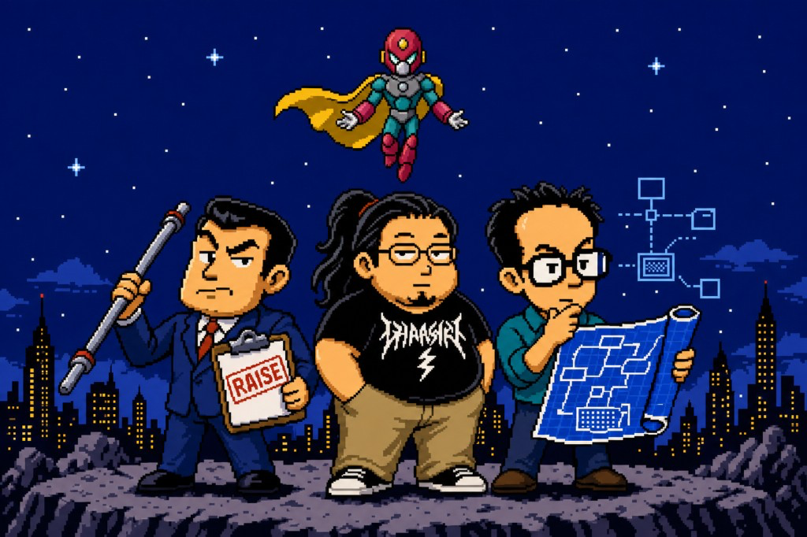

<p align="center">
  
</p>

<h1 align="center">Jarvis</h1>

<p align="center">
  <strong>Agents freestyle. Jarvis makes them follow the plan.</strong><br>
  Metaplans, specialists, and model tags — one install for Cursor and Claude Code.
</p>

<p align="center">
  <a href="LICENSE"></a>
  <a href="https://github.com/RaistlinD2x/jarvis/actions/workflows/ci.yml"></a>
  = 20">
  
  
  
</p>

```bash
npx jarvis install --host all
```

---

## Intent

Coding agents are eager. They skip the plan, invent a router, and ship a flat task list with the wrong model on the hard parts.

Jarvis is the opposite default: **structure the work before anyone writes**, assign a **specialist and a difficulty tag** to each executable leaf, and keep a **human** on irreversible calls. There is no executive router. The metaplan is the authority; the installed rules make the host honor it.

## What happens if you use it

1. You run the CLI in a project. Jarvis copies a rule pack into **Cursor** and/or **Claude Code**, plus a short doctrine spine (`AGENTS.md` / `CLAUDE.md`) and local state under `.jarvis/`.
2. Non-trivial asks become an **L0→L4 metaplan** (or an explicit trivial waiver). Dependencies and order live at L3. Every L4 names a **persona** and a **model** tag (`simple` | `complex`).
3. You dispatch work with `Metaplan only`, `Execute #id`, or `Execute ready leaves`. Agents follow the tagged persona and host-mapped model. Deviation → stop and ask.
4. Product, design, and implementation stay in their lanes: **Bar Raiser** scopes, **Architect** shapes, **Ponytail** codes — as leaves on the tree, not a pipeline you finish before planning.

## Docs

| Doc | What it covers |
|-----|----------------|
| [Metaplanning](docs/metaplanning.md) | L0→L4, node fields, waivers, execution protocol |
| [Personas](docs/personas.md) | Bar Raiser, Architect, Ponytail, and supporting roles |
| [Model tags](docs/models.md) | `simple` / `complex` and host defaults |
| [Install & CLI](docs/install.md) | Install, files written, commands, uninstall |
| [FAQ](docs/faq.md) | Common questions |

Canonical rule text ships in `pack/` and is what the CLI injects. These docs explain the system; the pack is the source of truth agents load.

## License

[MIT](LICENSE) — Copyright (c) 2026 [RaistlinD2x](https://github.com/RaistlinD2x).

Ponytail persona lineage: [DietrichGebert/ponytail](https://github.com/DietrichGebert/ponytail) (MIT). NES art is fan homage, not affiliation.
